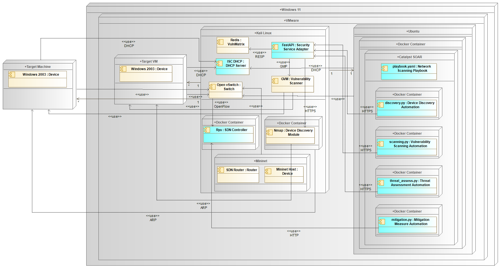

# Proactive Discovery and Mitigation of Security Vulnerabilities Leveraged by Software-Defined Networks

The developed system orchestrates automated vulnerability analysis and mitigation through a Security Orchestration, Automation and Response (SOAR) platform, using a vulnerability scanner and applying a mitigation measure, demonstrating VLAN switching through the SDN controller, isolating vulnerable devices.

It was designed a system with the ideas from the previous section in mind to address some of the identified open issues. The diagram in Figure 3.1 illustrates the main building blocks and workflow that make up the designed system. It begins with the detection phase, in which the system continuously monitors network devices for vulnerabilities, using active probing tools. The vulnerabilities detected are classified using formats such as CVE, which standardizes the information and allows for easier comparison and prioritization. Once the vulnerabilities have been classified, the system moves on to the analysis phase, where the severity and risk associated with each vulnerability are assessed. This analysis helps to determine the most effective mitigation measure. Based on the results, the mitigation phase is triggered, where appropriate mitigation measures are implemented, such as isolating compromised devices through VLAN changes or blocking malicious traffic.

Caso haja um erro com a socket do GVM podes tentar:
chmod 662 /var/run/gvmd/gvmd.sock

