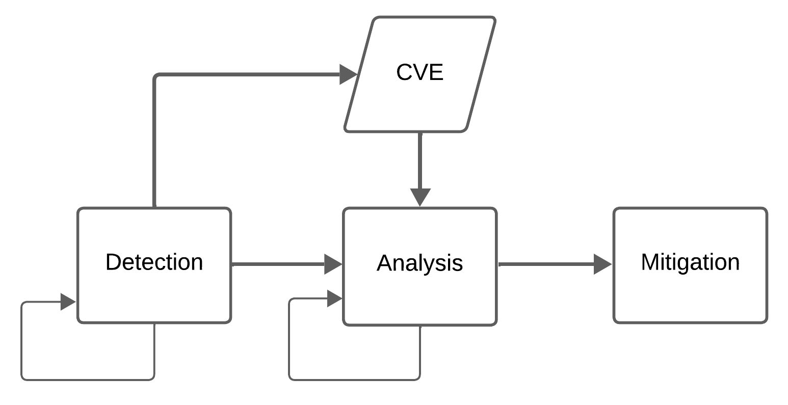
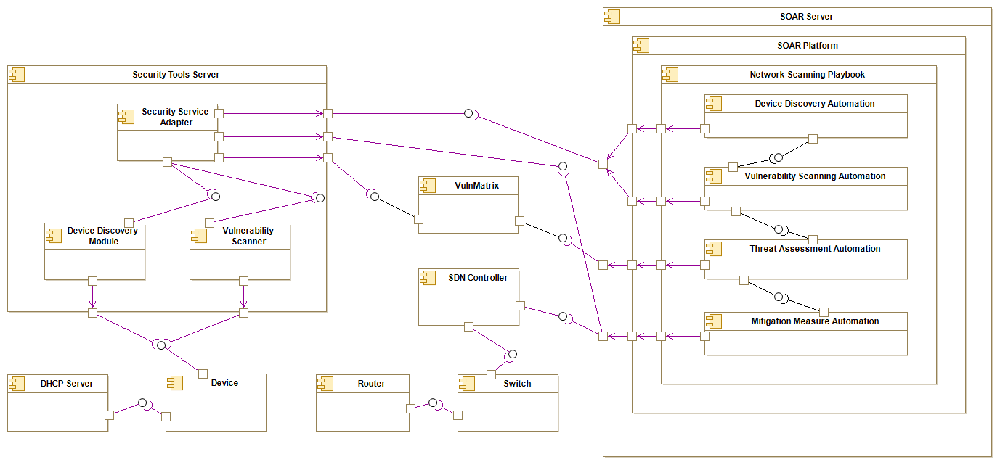
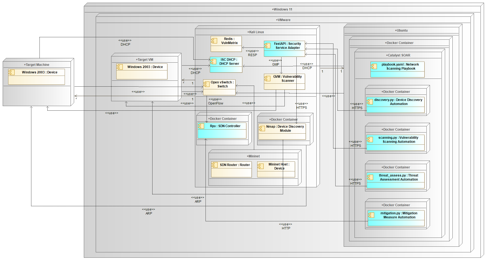
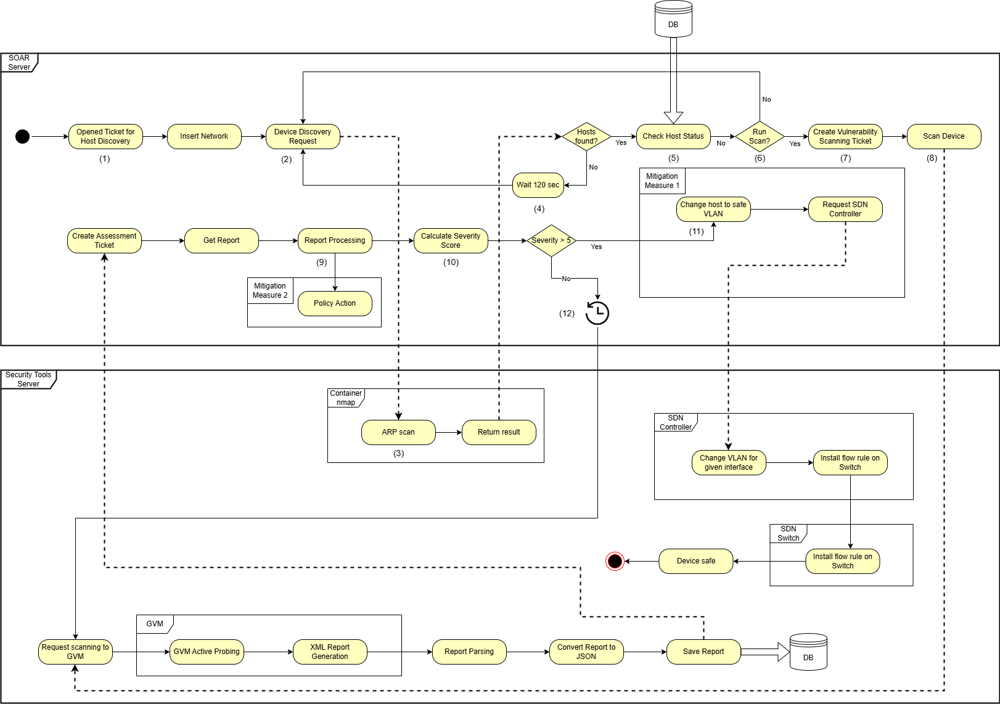

# Proactive Discovery and Mitigation of Security Vulnerabilities Leveraged by Software-Defined Networks

The developed system orchestrates automated vulnerability analysis and mitigation through a Security Orchestration, Automation and Response (SOAR) platform, using a vulnerability scanner and applying a mitigation measure, demonstrating VLAN switching through the SDN controller, isolating vulnerable devices.

Read my Survey [On the Road to Proactive Vulnerability Analysis and Mitigation Leveraged by Software Defined Networks: A Systematic Review](https://ieeexplore.ieee.org/document/10599429) to get a better understanding of the topic.

## Design

It was designed a system with the ideas from the previous section in mind to address some of the identified open issues. The next diagram illustrates the main building blocks and workflow that make up the designed system. It begins with the detection phase, in which the system continuously monitors network devices for vulnerabilities, using active probing tools. The vulnerabilities detected are classified using formats such as CVE, which standardizes the information and allows for easier comparison and prioritization. Once the vulnerabilities have been classified, the system moves on to the analysis phase, where the severity and risk associated with each vulnerability are assessed. This analysis helps to determine the most effective mitigation measure. Based on the results, the mitigation phase is triggered, where appropriate mitigation measures are implemented, such as isolating compromised devices through VLAN changes or blocking malicious traffic.



The system’s architecture has several fundamental components described in the component diagram. It consists of two primary elements: the SOAR Server and the Security Tools Server. The SOAR Server hosts the SOAR Platform, while the Security Tools Server houses essential tools, including the Vulnerability Scanner and the Device Discovery Module.



The Deployment Diagram is represented next. It provides an overview of how the logical components of the system, previously outlined, are deployed. It highlights the distribution of key services and applications, the interactions between them, and the communication protocols that are used. Components represented in blue have been created or their behavior modified.



In short, the process begins in the Security Orchestration, Automation, and Response (SOAR) by the creation of a network scanning ticket that requests a device discovery (1), thus initiating a device discovery task (2) from the Security Service Adapter (SSA). The system then checks for any active devices on the network (3) after sending the request. If no devices are detected, the process waits for a timeout period (4) before returning to the initial device discovery request, restarting the loop. After detection, the status of the device is checked in the database (5). This status refers to the date of the last vulnerability scan carried out on the device, and, based on this parameter, it is decided whether or not the device should be scanned (6). The SOAR then generates a vulnerability scanning ticket for each identified device (7) and starts the vulnerability scan (8). The scan results are analyzed (9) to calculate a severity score (10). Based on the calculated score, the SOAR initiates a Virtual Local Area Network (VLAN) change (i.e. Mitigation Measure 1) to relocate the device to a quarantine zone via the SDN controller (11). This mitigation strategy is just one of several possible approaches. Other measures (i.e. Mitigation Measure 2), such as Deep Packet Inspection (DPI) to analyze network traffic for malicious content, the use of firewall rules to block specific communication, or even Moving Target Defense (MTD) to dynamically shift the network configuration, could also be implemented. However, for the objectives of this dissertation, these alternatives were not explored, with the focus being on VLAN isolation as a proof of concept for automated containment. If the device is considered safe, the process concludes and a new scanning is scheduled in the future (12).



## Components 

### Catalyst SOAR

The version of Catalyst used in this system was 0.10.3. As this project is constantly being updated and improved, it is advisable to install it following the steps on the website. The OpenAPI code present here will no longer be useful, as Catalyst is now based on PocketBase, replacing much of the logic.

Therefore, the installation steps should be followed via the official Catalyst [Installation Guide](https://catalyst.security-brewery.com/docs/catalyst/admin/install).

### Security Service Adapter

The SSA integration allows OpenVAS to run and serves as a bridge to integrate different security tools with SOAR.

Install FastAPI:
```console
$ pip install fastapi
```

To run the SSA:
```console
$ python3 main.py
```

### Redis Database

The following commands explain how to install and run the Redis database:

```console
$ pip install redis 
```

```console
$ sudo apt-get install redis-server
```

```console
$ sudo service redis-server start
```

### Device Discovery Module

The files in the [Device Discovery Module](https://github.com/linuxer1337/sdn-vuln/tree/main/Device%20Discovery) require the installation of the nmap python library and may (or may not) be run in a docker container.

To install python-nmap:
```console
$ pip install python-nmap
```

To run the docker containing nmap:
```console
$ sudo docker run -it ubuntu-nmap:latest
```

### Vulnerability Scanner

Install GVM:
```console
$ sudo apt install gvm
```

If there is an error with the GVM socket you can try: 
```console
$ chmod 662 /var/run/gvmd/gvmd.sock
```
### Ryu SDN Controller

Run SDN Controller docker:
```console
$ sudo docker run -p 6653:6653 -p 8080:8080 -ti --rm my-ryu-image:latest /bin/bash 
```
Launch Ryu:
```console
$ ryu-manager ryu.py
```

If the controller doesn't detect traffic you can try:
```console
$ sudo pkill docker                                                                                                         
sudo iptables -t nat -F
sudo ifconfig docker0 down
sudo brctl delbr docker0
sudo systemctl start docker
sudo systemctl enable docker
```

Start OpenvSwitch:
```console
$ service openvswitch-switch start 
```

To add interfaces to the switch you must create them by adding network interfaces to the virtual machine and then add the interface to the switch using the following command:
```console
$ sudo ovs-vsctl add-port s1 eth6
```

If you want to update Ryu docker:
```console
$ sudo docker commit d30e4628d942 my-ryu-image:latest 
```

### DHCP Server

The ISC DHCP was used in this system; however, given the end of its support, it is advisable to migrate to another DHCP service, such as [Kea](https://www.isc.org/kea/), which is its successor.

Start ISC DHCP:
```console
$ sudo service isc-dhcp-server start 
```

## Steps Forward

- Install and implement the new version of Catalyst SOAR.
- Use [python-gvm](https://greenbone.github.io/python-gvm/) for integration.
- Replace polling method for callback to get the report from GVM.


